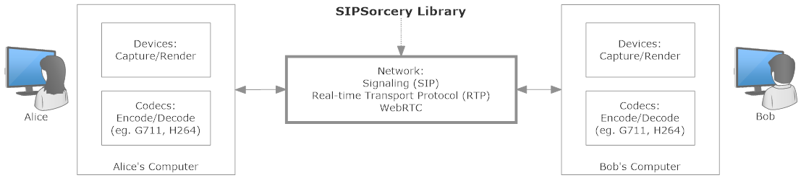

| Target        | SIPSorcery    | Examples <br/> (Windows Only)    | Softphone <br/> (Windows Only) |
| --------------| ------------- |:-------------|:--------- |
| net46        | [](https://ci.appveyor.com/project/sipsorcery/sipsorcery/branch/master) | | |
| netstandard2.0 |  |  |  |
| dotnetcore3.1 | <table><tr><td>Windows</td><td></td></tr><tr><td>MacOS</td><td></td></tr><tr><td>Ubuntu</td><td></td></tr></table> |  <br> [](https://ci.appveyor.com/project/sipsorcery/sipsorcery-mre1o/branch/master) | [](https://ci.appveyor.com/project/sipsorcery/sipsorcery-0p6s4/branch/master) |


## What Is It?

**This fully C# library can be used to add Real-time Communications, typically audio and video calls, to .NET Core applications.**

The diagram below is a high level overview of a Real-time audio and video call between Alice and Bob. It illustrates where the `SIPSorcery` library can help.



**Supports both VoIP ([get started](#getting-started-voip)) and WebRTC ([get started](#getting-started-webrtc)).**

**Some of the protocols supported:**

 - Session Initiation Protocol [(SIP)](https://tools.ietf.org/html/rfc3261),
 - Real-time Transport Protocol [(RTP)](https://tools.ietf.org/html/rfc3550),
 - Web Real-time Communications [(WebRTC)](https://www.w3.org/TR/webrtc/),
 - Interactive Connectivity Establishment [(ICE)](https://tools.ietf.org/html/rfc8445),
 - And more.

**Caveats:**

 - This library does not provide access to audio and video devices. Some Windows specific examples of using 3rd party libraries are provided,
 - This library provides only a small number of audio and video codecs (G711, G722 and MJPEG). Additional codecs, particularly video ones, require C++ libraries. 

## Installation

The library is compliant with .NET Standard 2.0, .Net Core 3.1 and .NET Framework 4.6. It is available via NuGet.

For .NET Core:

````bash
dotnet add package SIPSorcery -v 4.0.60-pre
````

With Visual Studio Package Manager Console (or search for [SIPSorcery on NuGet](https://www.nuget.org/packages/SIPSorcery/)):

````ps1
Install-Package SIPSorcery -v 4.0.60-pre
````

## Documentation

Class reference documentation and articles explaining common usage are available at [https://sipsorcery.github.io/sipsorcery/](https://sipsorcery.github.io/sipsorcery/).

## Getting Started VoIP

The simplest possible example to place an audio-only SIP call is shown below. This example relies on the Windows specific `SIPSorceryMedia` library to play the received audio and only works on Windows (due to lack of .NET Core audio device support on non-Windows platforms).

````bash
dotnet new console --name SIPGetStarted
cd SIPGetStarted
dotnet add package SIPSorcery -v 4.0.60-pre
dotnet add package SIPSorceryMedia -v 4.0.60-pre
code . # If you have Visual Studio Code https://code.visualstudio.com installed.
# edit Program.cs and paste in the contents below.
dotnet run
# if successful you will hear the current time read out.
ctrl-c
````

````csharp
using System;
using System.Threading.Tasks;
using SIPSorcery.SIP;
using SIPSorcery.SIP.App;
using SIPSorcery.Media;

namespace SIPGetStarted
{
    class Program
    {
         private static string DESTINATION = "time@sipsorcery.com";
        
        static async Task Main()
        {
            Console.WriteLine("SIP Get Started");
            
            var sipTransport = new SIPTransport();
            var userAgent = new SIPUserAgent(sipTransport, null);
            var rtpSession = new RtpAVSession(new AudioOptions { AudioSource = AudioSourcesEnum.CaptureDevice }, null);

            // Place the call and wait for the result.
            bool callResult = await userAgent.Call(DESTINATION, null, null, rtpSession);
            Console.WriteLine($"Call result {((callResult) ? "success" : "failure")}.");

            Console.WriteLine("Press any key to hangup and exit.");
            Console.ReadLine();
        }
    }
}
````

The [GetStarted](https://github.com/sipsorcery/sipsorcery/tree/master/examples/SIPExamples/GetStarted) example contains the full source and project file for the example above.

The three key classes in the above example are described in dedicated articles:

 - [SIPTransport](https://sipsorcery.github.io/sipsorcery/articles/transport.html),
 - [SIPUserAgent](https://sipsorcery.github.io/sipsorcery/articles/sipuseragent.html),
 - [RTPSession](https://sipsorcery.github.io/sipsorcery/articles/rtpsession.html).

The [examples folder](https://github.com/sipsorcery/sipsorcery/tree/master/examples/SIPExamples) contains sample code to demonstrate other common SIP/VoIP cases.

## Getting Started WebRTC

The core of the code required to establish a WebRTC connection is demonstrated below. The code shown will build but will not establish a connection due to no mechanism to exchange the SDP offer and answer between peers. A full working example with a web socket signalling mechanism is available in the [WebRTCTestPatternServer](https://github.com/sipsorcery/sipsorcery/tree/master/examples/WebRTCExamples/WebRTCTestPatternServer) example.

If you are familiar with the [WebRTC javascript API](https://www.w3.org/TR/webrtc/) the API in this project aims to be as close to it as possible.

````bash
dotnet new console --name WebRTCGetStarted
cd WebRTCGetStarted
dotnet add package SIPSorcery -v 4.0.60-pre
dotnet add package SIPSorceryMedia -v 4.0.60-pre
code . # If you have Visual Studio Code (https://code.visualstudio.com) installed
# edit Program.cs and paste in the contents below.
dotnet run
````

````csharp
using System;
using System.Collections.Generic;
using System.Threading.Tasks;
using SIPSorcery.Net;

namespace WebRTCGetStarted
{
    class Program
    {
        static async Task Main()
        {
            Console.WriteLine("Get Started WebRTC");
            
            var pc = new RTCPeerConnection(null);

            MediaStreamTrack videoTrack = new MediaStreamTrack(
              SDPMediaTypesEnum.video, 
              false, 
              new List<SDPMediaFormat> { new SDPMediaFormat(SDPMediaFormatsEnum.VP8) }, 
              MediaStreamStatusEnum.SendOnly);
            pc.addTrack(videoTrack);

            pc.oniceconnectionstatechange += (state) => Console.WriteLine($"ICE connection state change to {state}.");
            pc.onconnectionstatechange += (state) => Console.WriteLine($"Peer connection state change to {state}.");

            var offerSdp = pc.createOffer(null);
            await pc.setLocalDescription(offerSdp);

            Console.ReadLine();
        }
    }
}
````

The [examples folder](https://github.com/sipsorcery/sipsorcery/tree/master/examples/WebRTCExamples) contains sample code to demonstrate other common WebRTC cases.

