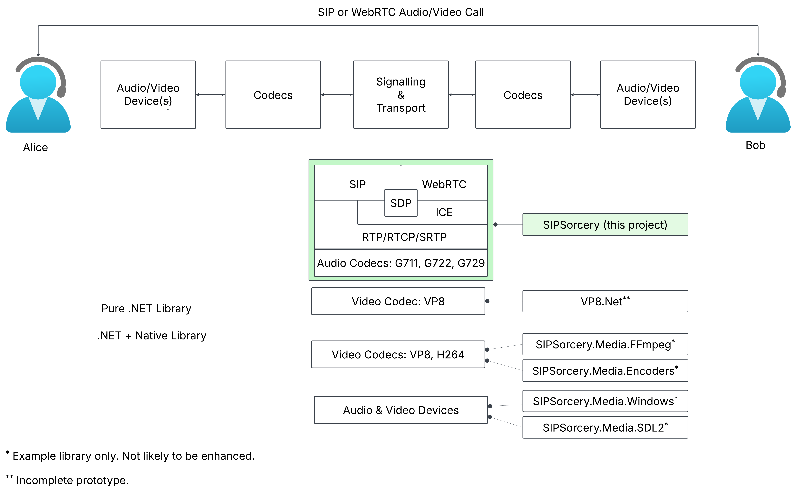

 
 
 


## What Is It?

**This fully C# library can be used to add Real-time Communications, typically audio and video calls, to .NET applications.**

The diagram below is a high level overview of a Real-time audio and video call between Alice and Bob. It illustrates where the `SIPSorcery` and associated libraries can help.



**Supports both VoIP ([get started](#getting-started-voip)) and WebRTC ([get started](#getting-started-webrtc)).**

**Some of the protocols supported:**

 - Session Initiation Protocol [(SIP)](https://tools.ietf.org/html/rfc3261),
 - Real-time Transport Protocol [(RTP)](https://tools.ietf.org/html/rfc3550),
 - Web Real-time Communications [(WebRTC)](https://www.w3.org/TR/webrtc/), **as of 26 Jan 2021 now an official IETF and W3C specification**,
 - Interactive Connectivity Establishment [(ICE)](https://tools.ietf.org/html/rfc8445),
 - SCTP, SDP, STUN and more.

**Media End Points - Audio/Video Sinks and Sources:**

 - The main `SIPSorcery` library does not provide access to audio and video devices or native codecs. Providing cross platform access to to these features on top of .NET is a large undertaking. A number of separate demonstration libraries show some different approaches to accessing audio/video devices and wrapping codecs with .NET. 
   - [SIPSorceryMedia.Windows](https://github.com/sipsorcery-org/SIPSorceryMedia.Windows): An example of a Windows specific library that provides audio capture and playback. 
   - [SIPSorceryMedia.Encoders](https://github.com/sipsorcery-org/SIPSorceryMedia.Encoders): An example of a Windows specific wrapper for the [VP8](https://www.webmproject.org/) video codec.
   - [SIPSorceryMedia.FFmpeg](https://github.com/sipsorcery-org/SIPSorceryMedia.FFmpeg): An example of a cross platform library that features audio and video codecs using PInvoke and [FFmpeg](https://ffmpeg.org/).
   - [SIPSorceryMedia.SDL2](https://github.com/sipsorcery-org/SIPSorceryMedia.SDL2): An example of integrating the cross-platform [SDL2](https://www.libsdl.org/index.php) Simple Direct Media Layer library.

 - This library provides only a small number of audio and video codecs (G711, G722 and G729). OPUS is available via [Concentus](https://github.com/lostromb/concentus). Additional codecs, particularly video ones, require C or C++ libraries. An effort is underway to port the [VP8](https://www.webmproject.org/) video codec to C# see [VP8.Net](https://github.com/sipsorcery-org/VP8.Net).

## Installation

The library is should work with .NET Framework >= 4.6.1 and all .NET Core and .NET versions. The demo applications initially targetted .NET Core 3.1 and are updated to later .NET versions as time and interest permit. The library is available via NuGet.

````bash
dotnet add package SIPSorcery
````

With Visual Studio Package Manager Console (or search for [SIPSorcery on NuGet](https://www.nuget.org/packages/SIPSorcery/)):

````ps1
Install-Package SIPSorcery
````

## Documentation

Class reference documentation and articles explaining common usage are available at [https://sipsorcery-org.github.io/sipsorcery/](https://sipsorcery-org.github.io/sipsorcery/).

## Getting Started VoIP

The simplest possible example to place an audio-only SIP call is shown below. This example relies on the Windows specific `SIPSorceryMedia.Windows` library to play the received audio and only works on Windows (due to lack of .NET audio device support on non-Windows platforms).

````bash
dotnet new console --name SIPGetStarted --framework net8.0 --target-framework-override net8.0-windows10.0.17763.0
cd SIPGetStarted
dotnet add package SIPSorcery
dotnet add package SIPSorceryMedia.Windows
# Paste the code below into Program.cs.
dotnet run
# If successful you will hear a "Hello World" announcement.
````

````csharp
string DESTINATION = "music@iptel.org";
        
Console.WriteLine("SIP Get Started");

var userAgent = new SIPSorcery.SIP.App.SIPUserAgent();
var winAudio = new SIPSorceryMedia.Windows.WindowsAudioEndPoint(new SIPSorcery.Media.AudioEncoder());
var voipMediaSession = new SIPSorcery.Media.VoIPMediaSession(winAudio.ToMediaEndPoints());

// Place the call and wait for the result.
bool callResult = await userAgent.Call(DESTINATION, null, null, voipMediaSession);
Console.WriteLine($"Call result {(callResult ? "success" : "failure")}.");

Console.WriteLine("Press any key to hangup and exit.");
Console.ReadLine();
````

The [GetStarted](https://github.com/sipsorcery-org/sipsorcery/tree/master/examples/SIPExamples/GetStarted) example contains the full source and project file for the example above.

The three key classes in the above example are described in dedicated articles:

 - [SIPTransport](https://sipsorcery-org.github.io/sipsorcery/articles/transport.html),
 - [SIPUserAgent](https://sipsorcery-org.github.io/sipsorcery/articles/sipuseragent.html),
 - [RTPSession](https://sipsorcery-org.github.io/sipsorcery/articles/rtpsession.html).

The [examples folder](https://github.com/sipsorcery-org/sipsorcery/tree/master/examples/SIPExamples) contains sample code to demonstrate other common SIP/VoIP cases.

## Getting Started WebRTC

The WebRTC specifications do not include directions about how signaling should be done (for VoIP the signaling protocol is SIP; WebRTC has no equivalent). The example below uses a simple JSON message exchange over web sockets for signaling. Part of the reason the `Getting Started WebRTC` is longer than the `Getting Started VoIP` example is the need for custom signaling.

The example requires two steps:

 - Run the `dotnet` console application,
 - Open an HTML page in a browser on the same machine.

 The full project file and code are available at [WebRTC Get Started](https://github.com/sipsorcery-org/sipsorcery/tree/master/examples/WebRTCExamples/WebRTCGetStarted).

The example relies on the Windows specific `SIPSorceryMedia.Encoders` package, which is mainly a wrapper around [libvpx](https://chromium.googlesource.com/webm/libvpx). Hopefully in the future there will be equivalent packages for other platforms.

**Step 1:**

````bash
dotnet new console --name WebRTCGetStarted
cd WebRTCGetStarted
dotnet add package SIPSorcery
dotnet add package SIPSorceryMedia.Encoders
# Paste the code below into Program.cs.
dotnet run
````

````csharp
using System;
using System.Linq;
using System.Net;
using System.Threading.Tasks;
using SIPSorcery.Media;
using SIPSorcery.Net;
using SIPSorceryMedia.Encoders;
using WebSocketSharp.Server;

namespace demo
{
    class Program
    {
        private const int WEBSOCKET_PORT = 8081;

        static void Main()
        {
            Console.WriteLine("WebRTC Get Started");

            // Start web socket.
            Console.WriteLine("Starting web socket server...");
            var webSocketServer = new WebSocketServer(IPAddress.Any, WEBSOCKET_PORT);
            webSocketServer.AddWebSocketService<WebRTCWebSocketPeer>("/", (peer) => peer.CreatePeerConnection = () => CreatePeerConnection());
            webSocketServer.Start();

            Console.WriteLine($"Waiting for web socket connections on {webSocketServer.Address}:{webSocketServer.Port}...");
            
            Console.WriteLine("Press any key exit.");
            Console.ReadLine();
        }

        private static Task<RTCPeerConnection> CreatePeerConnection()
        {
            var pc = new RTCPeerConnection(null);

            var testPatternSource = new VideoTestPatternSource(new VpxVideoEncoder());

            MediaStreamTrack videoTrack = new MediaStreamTrack(testPatternSource.GetVideoSourceFormats(), MediaStreamStatusEnum.SendOnly);
            pc.addTrack(videoTrack);

            testPatternSource.OnVideoSourceEncodedSample += pc.SendVideo;
            pc.OnVideoFormatsNegotiated += (formats) => testPatternSource.SetVideoSourceFormat(formats.First());

            pc.onconnectionstatechange += async (state) =>
            {
                Console.WriteLine($"Peer connection state change to {state}.");

                switch(state)
                {
                    case RTCPeerConnectionState.connected:
                        await testPatternSource.StartVideo();
                        break;
                    case RTCPeerConnectionState.failed:
                        pc.Close("ice disconnection");
                        break;
                    case RTCPeerConnectionState.closed:
                        await testPatternSource.CloseVideo();
                        testPatternSource.Dispose();
                        break;
                }
            };

            return Task.FromResult(pc);
        }
    }
}
````

**Step 2:**

Create an HTML file, paste the contents below into it, open it in a browser that supports WebRTC and finally press the `start` button.

````html
<!DOCTYPE html>
<head>
    <script type="text/javascript">
        const WEBSOCKET_URL = "ws://127.0.0.1:8081/"

        var pc, ws;

        async function start() {
            pc = new RTCPeerConnection();

            pc.ontrack = evt => document.querySelector('#videoCtl').srcObject = evt.streams[0];
            pc.onicecandidate = evt => evt.candidate && ws.send(JSON.stringify(evt.candidate));

            ws = new WebSocket(document.querySelector('#websockurl').value, []);
            ws.onmessage = async function (evt) {
                var obj = JSON.parse(evt.data);
                if (obj?.candidate) {
                    pc.addIceCandidate(obj);
                }
                else if (obj?.sdp) {
                    await pc.setRemoteDescription(new RTCSessionDescription(obj));
                    pc.createAnswer()
                        .then((answer) => pc.setLocalDescription(answer))
                        .then(() => ws.send(JSON.stringify(pc.localDescription)));
                }
            };
        };

        async function closePeer() {
            await pc?.close();
            await ws?.close();
        };

    </script>
</head>
<body>

    <video controls autoplay="autoplay" id="videoCtl" width="640" height="480"></video>

    <div>
        <input type="text" id="websockurl" size="40" />
        <button type="button" class="btn btn-success" onclick="start();">Start</button>
        <button type="button" class="btn btn-success" onclick="closePeer();">Close</button>
    </div>

</body>

<script>
    document.querySelector('#websockurl').value = WEBSOCKET_URL;
</script>
````

**Result:**

If successful the browser should display a test pattern image.

The [examples folder](https://github.com/sipsorcery-org/sipsorcery/tree/master/examples/WebRTCExamples) contains sample code to demonstrate other common WebRTC cases.
