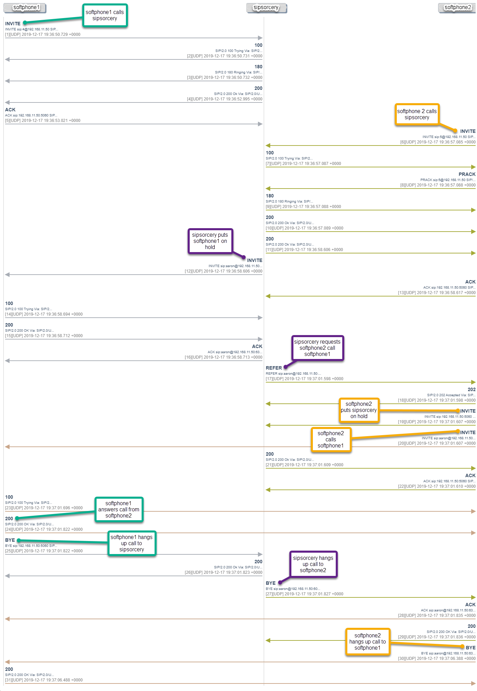

## Attended Transfer

The [Attended Transfer](https://github.com/sipsorcery/sipsorcery/tree/master/examples/AttendedTransfer) program contains an example of how initiate an attended transfer between two established calls.

The example program works in the following manner:

1. Establish two calls by using a different SIP device or softphone to "call" the example program. By default the program listens on all local IP addresses and port 5060.

2. Once a call is established press the `t` key to initiate the attended transfer.

3. Once a notification is received that the transfer was accepted and successful the program will hangup the orphaned call leg and exit.

### Call Flow

The diagram below represents a typical call flow when using this program. In this case two different softphones are calling the example program one after the other. When both calls are ready the `t` key is pressed and the attended transfer succeeds.

