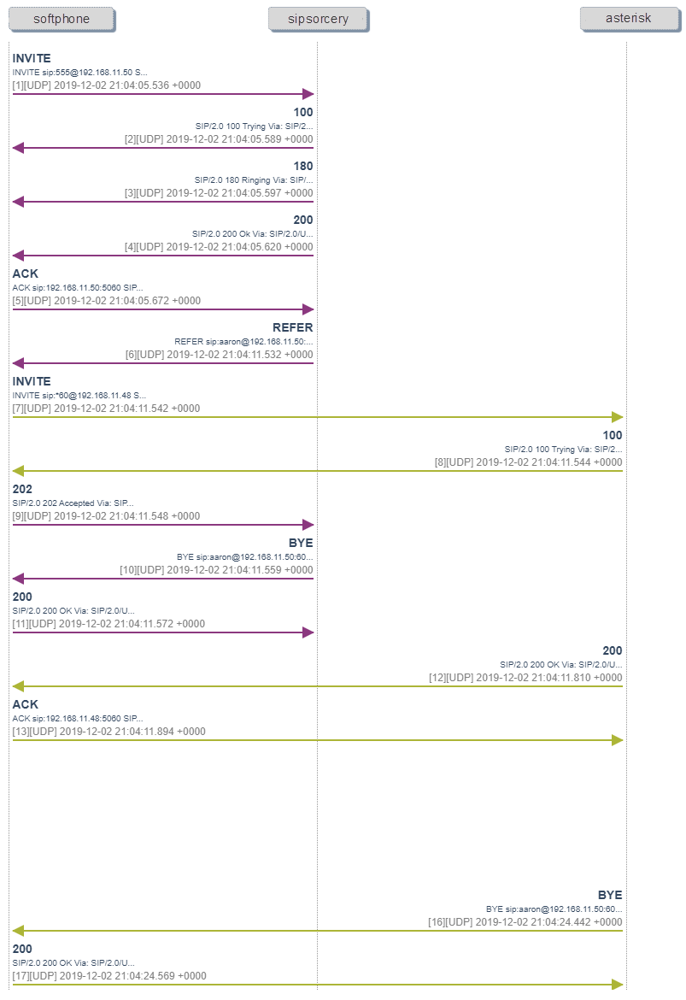

## Call Hold and Transfer

The [Call Hold and Transfer](https://github.com/sipsorcery/sipsorcery/tree/master/examples/CallHoldAndTransfer) program contains an example of how to place an established call on and off hold as well as initiate blind transfers.

The example program works in the follwing manner:

1. Establish a call by using a different SIP device or softphone to "call" the sample. By default the program listens on all local IP addresses and port 5060. Alternatively the program will call the `DEFAULT_DESTINATION_SIP_URI` if the `c` key is pressed.

2. Once a call is established press the `h` key to put the call on and off hold.

3. A blind transfer to the hard coded `TRANSFER_DESTINATION_SIP_URI` can be initiated by pressing the `t` key. Once the transfer is accepted the program no longer has access to the established call and closes.

### Call Hold

There are a number of different ways to put a SIP call on hold. This example uses SIP re-INVITE requests with the RTP flow attribute modified to indicate the call hold status.

The interest pieces of code as far as putting the call on hold is in the [SIPUserAgent](https://github.com/sipsorcery/sipsorcery/blob/master/src/app/SIPUserAgents/SIPUserAgent.cs) class and the `DialogRequestReceivedAsync`. The relevant code block from that method is shown below. It revolves around the checking and setting of the media stream status atttribute on an RTP stream.

````csharp
// Check for remote party putting us on and off hold.
SDP newSDPOffer = SDP.ParseSDPDescription(sipRequest.Body);
if (newSDPOffer.GetMediaStreamStatus(SDPMediaTypesEnum.audio, 0) == MediaStreamStatusEnum.SendOnly)
{
	// We've been put on hold.
	var onHoldResponse = ProcessRemoteHoldRequest(sipRequest, MediaStreamStatusEnum.RecvOnly);
	reInviteTransaction.SendFinalResponse(onHoldResponse);

	RemotePutOnHold?.Invoke();
}
else if (newSDPOffer.GetMediaStreamStatus(SDPMediaTypesEnum.audio, 0) == MediaStreamStatusEnum.SendRecv && OnHoldFromRemote)
{
	// We've been taken off hold.
	var offHoldResponse = ProcessRemoteHoldRequest(sipRequest, MediaStreamStatusEnum.SendRecv);
	reInviteTransaction.SendFinalResponse(offHoldResponse);

	RemoteTookOffHold?.Invoke();
}
````

The hold mechanism becomes more obvious by looking at the Session Description Protocol (SDP) payloads for the re-INVITE requests. Each call hold is done by changing a single attribute on the SDP and sending it to the remote party via a re-INVITE request.

The SDP below is for an RTP stream that is not on hold. The important attribute is the last one, `a=sendrecv`.

````
v=0
o=- 49809 0 IN IP4 192.168.11.50
s=sipsorcery
c=IN IP4 192.168.11.50
t=0 0
m=audio 48000 RTP/AVP 0
a=rtpmap:0 PCMU/8000
a=sendrecv
````

The remote call party can be put on hold using.

````
v=0
o=- 49735 0 IN IP4 192.168.11.50
s=sipsorcery
c=IN IP4 192.168.11.50
t=0 0
m=audio 48000 RTP/AVP 0
a=rtpmap:0 PCMU/8000
a=sendonly
````

They will respond with an SDP payload with the last attribute set as `a=recvonly`.

````
v=0
o=- 1667266393 3 IN IP4 192.168.11.50
s=Bria 4 release 4.8.1 stamp 84929
c=IN IP4 192.168.11.50
t=0 0
m=audio 59228 RTP/AVP 0
a=recvonly
````

To take the call off hold the RTP flow attribute needs to be set back to `sendrecv` as shown in the first SDP packet.

### Blind Transfer

The blind transfer function in the program demonstrates how to direct a remote call party to call a new destination. In a blind transfer the remote call party is requested to place a new call directly. An `Attended Transfer` is where the transferee places the call, does some talking (assumedly) and then bridges the two parties together.

The example uses REFER requests as specified in [RFC3515](https://tools.ietf.org/html/rfc3515).

The key piece of code is again in the [SIPUserAgent](https://github.com/sipsorcery/sipsorcery/blob/master/src/app/SIPUserAgents/SIPUserAgent.cs) class and a combination of the `GetReferRequest` method, which is shown below and the `Transfer` method.

````csharp
/// <summary>
/// Builds the REFER request to initiate a blind transfer on an established call.
/// </summary>
/// <param name="referToUri">The SIP URI to transfer the call to.</param>
/// <returns>A SIP REFER request.</returns>
private SIPRequest GetReferRequest(SIPURI referToUri)
{
	SIPRequest referRequest = Dialogue.GetInDialogRequest(SIPMethodsEnum.REFER);
	referRequest.Header.ReferTo = referToUri.ToString();
	referRequest.Header.Supported = SIPExtensionHeaders.NO_REFER_SUB;
	referRequest.Header.Contact = new List<SIPContactHeader> { SIPContactHeader.GetDefaultSIPContactHeader() };
	return referRequest;
}
````

The diagram below represents a typical call flow when using this program. The `softphone` calls the `sipsorcery` program. After answering the `sipsorcery` program transfers the `softphone` by requesting it to place a call to the `asterisk` server.



In the `REFER` request the mst important header is the `ReferTo`. It's what determines where the remote user agent will is being asked to place a new call to.

**It's important to note that a REFER request "asks" the remote user agent to try placing a new call to the SIP URI specified. There is no guarantee it will or that the call will succeed. It's important to deal with cases where the REFER request is rejected.**

Below is the console output of a successful call transfer using the example code and a local Asterisk\FreePBX server.

````cmd
C:\Dev\sipsorcery\sipsorcery-core\examples\CallTransfer>dotnet run
SIPSorcery client user agent example.
Press ctrl-c to exit.
[21:41:05 INF] Call destination sip:100@192.168.11.48.
[21:41:05 DBG] SIPUDPChannel listener created 0.0.0.0:6060.
[21:41:05 DBG] SIPUDPChannel socket on udp:0.0.0.0:6060 listening started.
[21:41:05 DBG] Request sent: udp:0.0.0.0:6060->udp:192.168.11.48:5060
[21:41:05 DBG] OPTIONS sip:100@192.168.11.48 SIP/2.0
Via: SIP/2.0/UDP 0.0.0.0:6060;branch=z9hG4bK606f5c765d9d430a9ac6a7325cb8fe0c;rport
To: <sip:100@192.168.11.48>
From: <sip:0.0.0.0:6060>;tag=HYSDCANLXD
Call-ID: db3bbb46071c41968c623a3d7ab01489
CSeq: 1 OPTIONS
Contact: <sip:0.0.0.0:6060>
Max-Forwards: 70
Allow: ACK, BYE, CANCEL, INFO, INVITE, NOTIFY, OPTIONS, REFER, REGISTER, SUBSCRIBE
Content-Length: 0


[21:41:05 DBG] Response received: udp:0.0.0.0:6060<-udp:192.168.11.48:5060
[21:41:05 DBG] SIP/2.0 200 OK
Via: SIP/2.0/UDP 0.0.0.0:6060;rport=6060;received=192.168.11.50;branch=z9hG4bK606f5c765d9d430a9ac6a7325cb8fe0c
To: <sip:100@192.168.11.48>;tag=z9hG4bK606f5c765d9d430a9ac6a7325cb8fe0c
From: <sip:0.0.0.0>;tag=HYSDCANLXD
Call-ID: db3bbb46071c41968c623a3d7ab01489
CSeq: 1 OPTIONS
Accept: application/dialog-info+xml, application/xpidf+xml, application/cpim-pidf+xml, application/simple-message-summary, application/pidf+xml, application/pidf+xml, application/dialog-info+xml, application/simple-message-summary, application/sdp, message/sipfrag;version=2.0
Accept-Encoding: text/plain
Accept-Language: en
Allow: OPTIONS, REGISTER, SUBSCRIBE, NOTIFY, PUBLISH, INVITE, ACK, BYE, CANCEL, UPDATE, PRACK, MESSAGE, REFER
Supported: 100rel, timer, replaces, norefersub
Content-Length: 0
Server: FPBX-15.0.16.20(16.4.1)


[21:41:05 DBG] Response received udp:0.0.0.0:6060<-udp:192.168.11.48:5060: OPTIONS 200 OK
[21:41:05 DBG] Successfully bound RTP socket 192.168.11.50:49000.
[21:41:05 DBG] Listening on RTP socket 192.168.11.50:49000.
[21:41:05 DBG] Attempting to resolve 192.168.11.48.
[21:41:05 DBG] Switching to sip:100@192.168.11.48:5060 via udp:192.168.11.48:5060.
[21:41:05 DBG] SDP on UAC could not be mangled, using original RTP socket of 192.168.11.50:49000.
[21:41:05 DBG] Send Request reliable udp:0.0.0.0:6060->udp:192.168.11.48:5060: INVITE sip:100@192.168.11.48 SIP/2.0
[21:41:05 DBG] Request sent: udp:0.0.0.0:6060->udp:192.168.11.48:5060
[21:41:05 DBG] INVITE sip:100@192.168.11.48 SIP/2.0
Via: SIP/2.0/UDP 0.0.0.0:6060;branch=z9hG4bK76c11432449d48e6805fb89adb686752;rport
To: <sip:100@192.168.11.48>
From: <sip:thisis@anonymous.invalid>;tag=FEDPDHKAQK
Call-ID: a5b30d51d07d42dfb39b4fe8d02f6f6a
CSeq: 1 INVITE
Contact: <sip:Anonymous@pcdodo:6060>
Max-Forwards: 70
User-Agent: www.sipsorcery.com
Supported: 100rel
Content-Length: 143
Content-Type: application/sdp

v=0
o=- 49124 0 IN IP4 192.168.11.50
s=sipsorcery
c=IN IP4 192.168.11.50
t=0 0
m=audio 49000 RTP/AVP 0
a=rtpmap:0 PCMU/8000
a=sendrecv

[21:41:06 DBG] Response received: udp:0.0.0.0:6060<-udp:192.168.11.48:5060
[21:41:06 DBG] SIP/2.0 100 Trying
Via: SIP/2.0/UDP 0.0.0.0:6060;rport=6060;received=192.168.11.50;branch=z9hG4bK76c11432449d48e6805fb89adb686752
To: <sip:100@192.168.11.48>
From: <sip:thisis@anonymous.invalid>;tag=FEDPDHKAQK
Call-ID: a5b30d51d07d42dfb39b4fe8d02f6f6a
CSeq: 1 INVITE
Content-Length: 0
Server: FPBX-15.0.16.20(16.4.1)


[21:41:06 DBG] Received Response udp:0.0.0.0:6060<-udp:192.168.11.48:5060: INVITE 100 Trying
[21:41:06 DBG] Information response 100 Trying for sip:100@192.168.11.48.
[21:41:06 INF] sip:100@192.168.11.48 Trying: 100 Trying.
[21:41:06 DBG] SIP/2.0 100 Trying
Via: SIP/2.0/UDP 0.0.0.0:6060;rport=6060;received=192.168.11.50;branch=z9hG4bK76c11432449d48e6805fb89adb686752
To: <sip:100@192.168.11.48>
From: <sip:thisis@anonymous.invalid>;tag=FEDPDHKAQK
Call-ID: a5b30d51d07d42dfb39b4fe8d02f6f6a
CSeq: 1 INVITE
Content-Length: 0
Server: FPBX-15.0.16.20(16.4.1)


[21:41:06 DBG] Response received: udp:0.0.0.0:6060<-udp:192.168.11.48:5060
[21:41:06 DBG] SIP/2.0 180 Ringing
Via: SIP/2.0/UDP 0.0.0.0:6060;rport=6060;received=192.168.11.50;branch=z9hG4bK76c11432449d48e6805fb89adb686752
To: <sip:100@192.168.11.48>;tag=b2b886e3-84f5-4bbc-8c05-74b115d7edcb
From: <sip:thisis@anonymous.invalid>;tag=FEDPDHKAQK
Call-ID: a5b30d51d07d42dfb39b4fe8d02f6f6a
CSeq: 1 INVITE
Contact: <sip:192.168.11.48:5060>
Allow: OPTIONS, REGISTER, SUBSCRIBE, NOTIFY, PUBLISH, INVITE, ACK, BYE, CANCEL, UPDATE, PRACK, MESSAGE, REFER
Content-Length: 0
Server: FPBX-15.0.16.20(16.4.1)


[21:41:06 DBG] Received Response udp:0.0.0.0:6060<-udp:192.168.11.48:5060: INVITE 180 Ringing
[21:41:06 DBG] Information response 180 Ringing for sip:100@192.168.11.48.
[21:41:06 INF] sip:100@192.168.11.48 Ringing: 180 Ringing.
[21:41:06 DBG] Response received: udp:0.0.0.0:6060<-udp:192.168.11.48:5060
[21:41:06 DBG] SIP/2.0 180 Ringing
Via: SIP/2.0/UDP 0.0.0.0:6060;rport=6060;received=192.168.11.50;branch=z9hG4bK76c11432449d48e6805fb89adb686752
To: <sip:100@192.168.11.48>;tag=b2b886e3-84f5-4bbc-8c05-74b115d7edcb
From: <sip:thisis@anonymous.invalid>;tag=FEDPDHKAQK
Call-ID: a5b30d51d07d42dfb39b4fe8d02f6f6a
CSeq: 1 INVITE
Contact: <sip:192.168.11.48:5060>
Allow: OPTIONS, REGISTER, SUBSCRIBE, NOTIFY, PUBLISH, INVITE, ACK, BYE, CANCEL, UPDATE, PRACK, MESSAGE, REFER
Content-Length: 0
Server: FPBX-15.0.16.20(16.4.1)


[21:41:06 DBG] Received Response udp:0.0.0.0:6060<-udp:192.168.11.48:5060: INVITE 180 Ringing
[21:41:06 DBG] Information response 180 Ringing for sip:100@192.168.11.48.
[21:41:06 INF] sip:100@192.168.11.48 Ringing: 180 Ringing.
[21:41:10 DBG] Response received: udp:0.0.0.0:6060<-udp:192.168.11.48:5060
[21:41:10 DBG] Initial RTP packet recieved from 192.168.11.48:15300.
[21:41:10 DBG] SIP/2.0 200 OK
Via: SIP/2.0/UDP 0.0.0.0:6060;rport=6060;received=192.168.11.50;branch=z9hG4bK76c11432449d48e6805fb89adb686752
To: <sip:100@192.168.11.48>;tag=b2b886e3-84f5-4bbc-8c05-74b115d7edcb
From: <sip:thisis@anonymous.invalid>;tag=FEDPDHKAQK
Call-ID: a5b30d51d07d42dfb39b4fe8d02f6f6a
CSeq: 1 INVITE
Contact: <sip:192.168.11.48:5060>
Allow: OPTIONS, REGISTER, SUBSCRIBE, NOTIFY, PUBLISH, INVITE, ACK, BYE, CANCEL, UPDATE, PRACK, MESSAGE, REFER
Supported: 100rel, timer, replaces, norefersub
Content-Length: 169
Content-Type: application/sdp
Server: FPBX-15.0.16.20(16.4.1)

v=0
o=- 49124 2 IN IP4 192.168.11.48
s=Asterisk
c=IN IP4 192.168.11.48
t=0 0
m=audio 15300 RTP/AVP 0
a=rtpmap:0 PCMU/8000
a=ptime:20
a=maxptime:150
a=sendrecv

[21:41:10 DBG] Received Response udp:0.0.0.0:6060<-udp:192.168.11.48:5060: INVITE 200 OK
[21:41:10 DBG] Send Request udp:0.0.0.0:6060->udp:192.168.11.48:5060: ACK sip:192.168.11.48:5060 SIP/2.0
[21:41:10 DBG] Request sent: udp:0.0.0.0:6060->udp:192.168.11.48:5060
[21:41:10 DBG] ACK sip:192.168.11.48:5060 SIP/2.0
Via: SIP/2.0/UDP 0.0.0.0:6060;branch=z9hG4bK26032492c2af40f9963efa80577642e9;rport
To: <sip:100@192.168.11.48>;tag=b2b886e3-84f5-4bbc-8c05-74b115d7edcb
From: <sip:thisis@anonymous.invalid>;tag=FEDPDHKAQK
Call-ID: a5b30d51d07d42dfb39b4fe8d02f6f6a
CSeq: 1 ACK
Max-Forwards: 70
Content-Length: 0


[21:41:10 DBG] Response 200 OK for sip:100@192.168.11.48.
[21:41:10 DBG] SDP on UAC response could not be mangled, RTP socket 192.168.11.48:15300.
[21:41:11 INF] sip:100@192.168.11.48 Answered: 200 OK.
[21:41:11 DBG] Remote RTP socket 192.168.11.48:15300.
[21:41:16 DBG] Request sent: udp:0.0.0.0:6060->udp:192.168.11.48:5060
[21:41:16 DBG] REFER sip:192.168.11.48:5060 SIP/2.0
Via: SIP/2.0/UDP 0.0.0.0:6060;branch=z9hG4bKcb147fd53f5149678c0c52908f2f5d9c;rport
To: <sip:100@192.168.11.48>;tag=b2b886e3-84f5-4bbc-8c05-74b115d7edcb
From: <sip:thisis@anonymous.invalid>;tag=FEDPDHKAQK
Call-ID: a5b30d51d07d42dfb39b4fe8d02f6f6a
CSeq: 2 REFER
Contact: <sip:Anonymous@pcdodo:6060>
Max-Forwards: 70
Content-Length: 0
Refer-To: sip:*60@192.168.11.48


[21:41:16 DBG] Response received: udp:0.0.0.0:6060<-udp:192.168.11.48:5060
[21:41:16 DBG] SIP/2.0 202 Accepted
Via: SIP/2.0/UDP 0.0.0.0:6060;rport=6060;received=192.168.11.50;branch=z9hG4bKcb147fd53f5149678c0c52908f2f5d9c
To: <sip:100@192.168.11.48>;tag=b2b886e3-84f5-4bbc-8c05-74b115d7edcb
From: <sip:thisis@anonymous.invalid>;tag=FEDPDHKAQK
Call-ID: a5b30d51d07d42dfb39b4fe8d02f6f6a
CSeq: 2 REFER
Contact: <sip:192.168.11.48:5060>
Expires: 600
Allow: OPTIONS, REGISTER, SUBSCRIBE, NOTIFY, PUBLISH, INVITE, ACK, BYE, CANCEL, UPDATE, PRACK, MESSAGE, REFER
Supported: 100rel, timer, replaces, norefersub
Content-Length: 0
Server: FPBX-15.0.16.20(16.4.1)


[21:41:16 INF] Call transfer was accepted by remote server.
[21:41:16 INF] Exiting...
[21:41:16 DBG] Initialising DNS resolver with operating system DNS server entries.
[21:41:16 DBG] DNS server 8.8.8.8:53
[21:41:16 DBG] DNS server 192.168.0.1:53
[21:41:16 DBG] DNSManager Stopping.
[21:41:16 INF] Shutting down SIP transport...
[21:41:16 DBG] Closing SIP UDP Channel udp:0.0.0.0:6060.
[21:41:16 DBG] SIPUDPChannel socket on udp:0.0.0.0:6060 listening halted.
````
