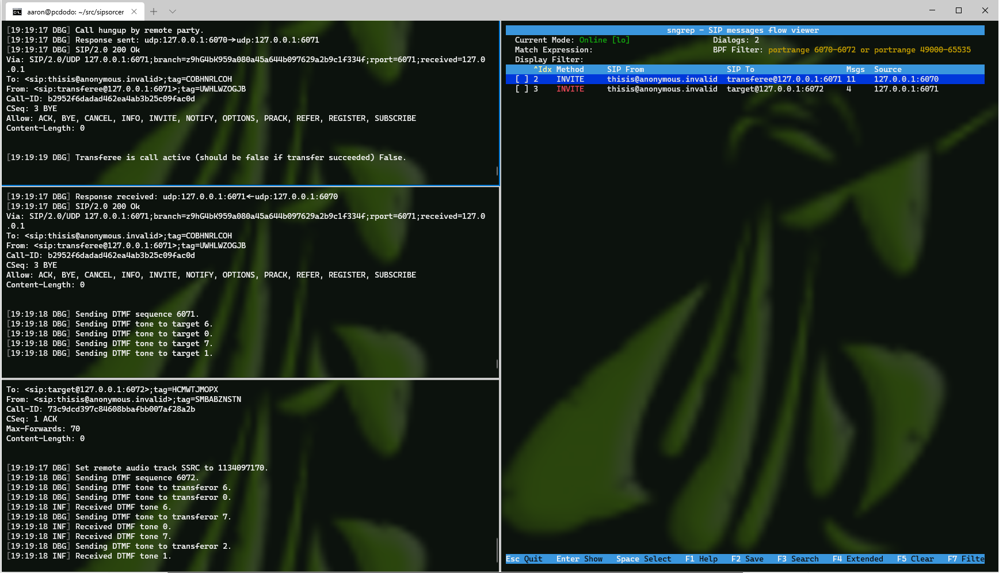
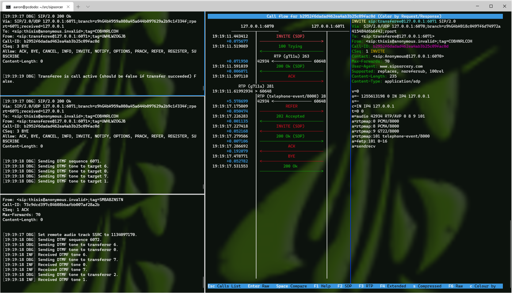
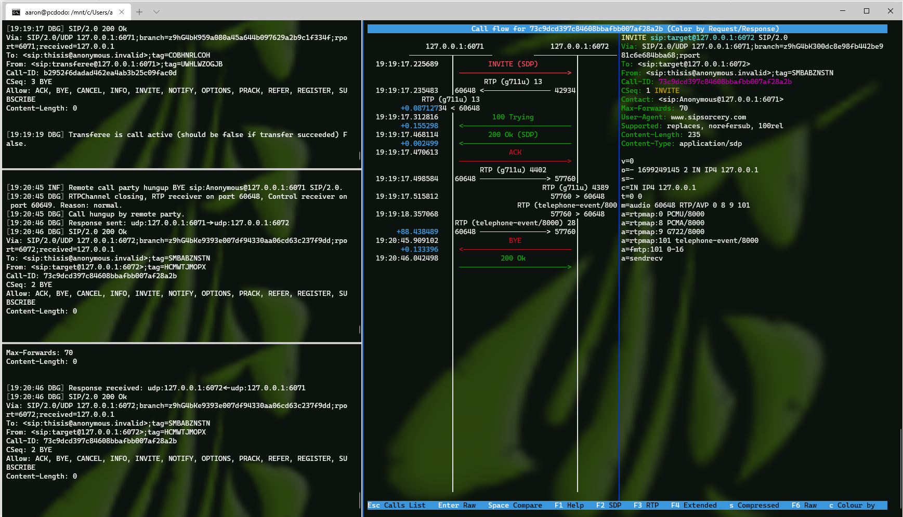
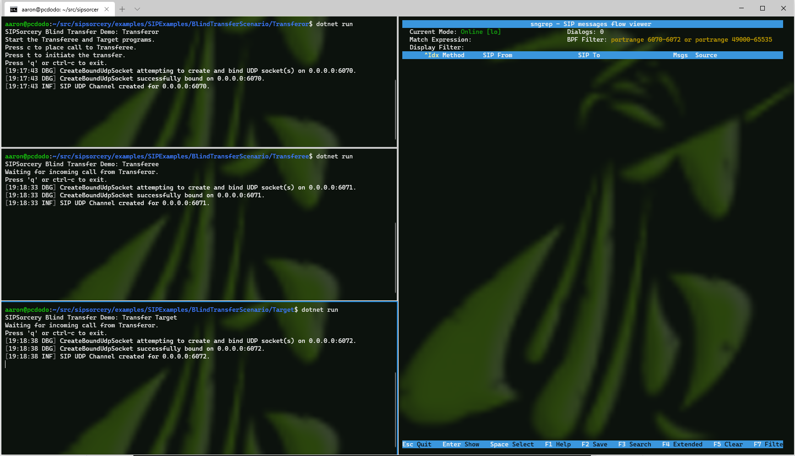

## Usage

The programs in this directory perform a SIP Blind Transfer test scenario.

A Blind Transfer is described in [Section 6. Basic Transfer](https://tools.ietf.org/html/rfc5589#section-6) of the [Session Initiation Protocol (SIP) Call Control - Transfer](https://tools.ietf.org/html/rfc5589) RFC.

You will need `.Net Core` and optionally, if you wish to view a SIP trace, [sngrep](https://github.com/irontec/sngrep), installed.

- Start the three programs:

`Transferor$ dotnet run`

`Transferee$ dotnet run`

`Target$ dotnet run`

- Optionally start `sngrep` to view a live SIP trace:

`sudo sngrep -r -d lo portrange 6070-6072 or portrange 49000-65535`

- On the `Transferor` console press `c` to create a call between the `Transferor` and the `Transferee`.

  - When the call is answered the `Transferee` sends a DTMF sequence of 6071 to the `Transferor` to verify that the RTP connection is correct. The DTMF sequence should appear on the `Transferor` console.

- On the `Transferor` console press `t` to initiate the Blind Transfer.

  - When the call is answered the `Target` sends a DTMF sequence of 6072 to the `Transferee` to verify that the RTP connection is correct. The DTMF sequence should appear on the `Transferor` console.

- On the `Transferee` or `Target` console press `h` to hangup the call.

#### Screenshot of sngrep call list from Blind Transfer Scenario

#### Screenshot of sngrep SIP trace for Transferor <-> Transferee

#### Screenshot of sngrep SIP trace for Transferee <-> Target

#### Screenshot of the 3 programs running the Blind Transfer Scenario

