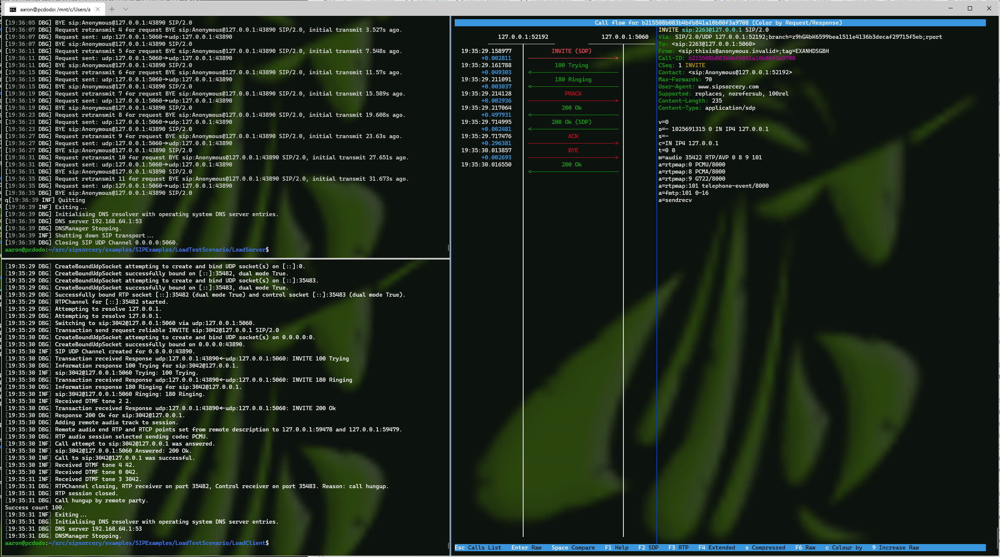

## Usage

The client and server programs in this directory perform a SIP and RTP load test.

You will need `.Net Core` and optionally, if you wish to view a SIP trace, [sngrep](https://github.com/irontec/sngrep), installed.

- Optionally start `sngrep` to view a live SIP trace:

 `$ sudo sngrep -r -d lo port 5060`

- Start the server program in the `LoadServer` directory:

`LoadServer$ dotnet run`

- Start the client program in the `LoadClient` directory:

`LoadClient$ dotnet run`

The `LoadClient` program attempts 100 calls to the server. Once each call is established a DTMF sequence is sent to ensure the RTP channel has been correctly initialised. If the DTMF sequence is not received by the client within 5s the test is deemed a failure and the client exits.

#### Screenshot of completed load test

#### Screenshot of a single test SIP flow

