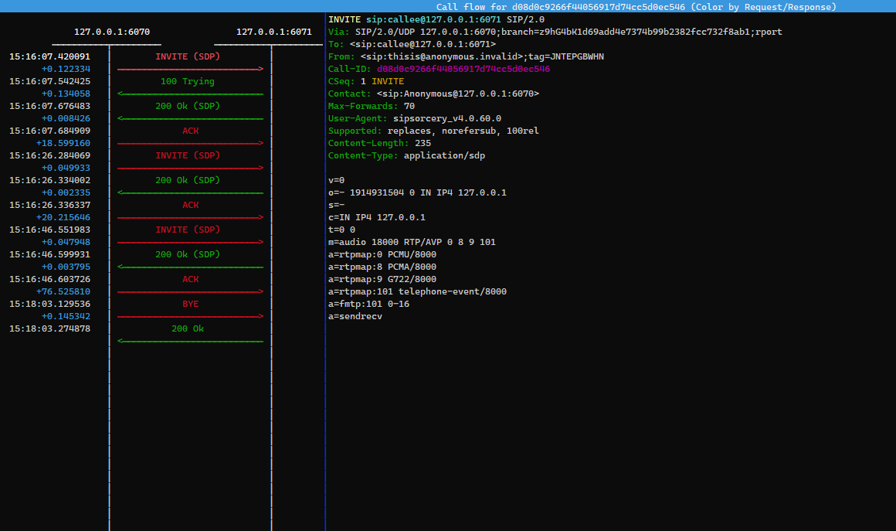

## Usage

The programs in this directory perform a SIP On Hold test scenario.

You will need `.Net Core` and optionally, if you wish to view a SIP trace, [sngrep](https://github.com/irontec/sngrep), installed.

- Start the two programs:

`Caller$ dotnet run`

`Callee$ dotnet run`

- Optionally start `sngrep` to view a live SIP trace:

`sudo sngrep -r -d lo portrange 6070-6071 or portrange 49000-65535`

- On the `Caller` console press `c` to create a call between the `Caller` and the `Callee`.

  - When the call is answered the `Callee` sends a DTMF sequence of 6071 to the `Caller` to verify that the RTP connection is correct. The DTMF sequence should appear on the `Caller` console.

- On the `Caller` console press `h` to place the call on hold. Press again to take off hold.

- On the `Caller` or `Callee` console press `b` to hangup the call.

#### Screenshot of sngrep SIP flow for the call being placed on and off hold

