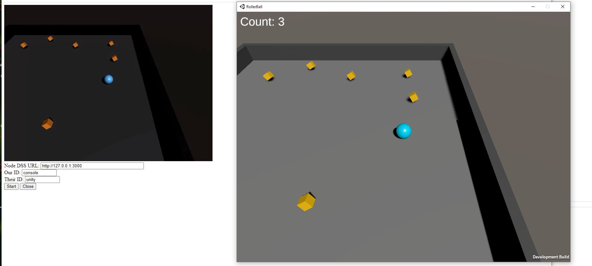
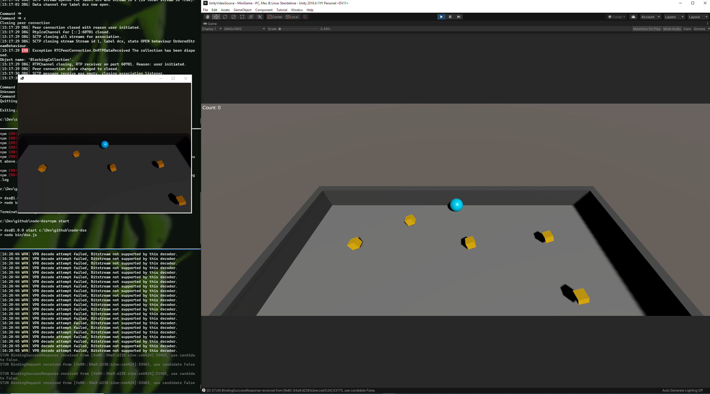

# Description

This example is based on the [Roll-a-Ball](https://learn.unity.com/project/roll-a-ball) tutorial. It adds the ability to receive the output from the Unity game player camera as a WebRTC video stream.

The screenshots below shows the game running in both the Unity Editor and as a standalone executable. The camera stream from the Unity game is displayed in a Windows Form or Web Browser after it has been transported over a WebRTC connection. 

In this example both the source and viewer programs are on the same machine but the point of using WebRTC is that the two programs could be anywhere on the Internet and still able to communicate.

## Usage: Unity Camera Stream to Browser

1. Start [node-dss](https://github.com/bengreenier/node-dss) with `npm start`,

2. Run the Roller Ball game by pressing the `Play` button in the Unity Editor or by building and running `RollerBall.exe`. The C# script in the Unity game should post an SDP offer to the `node-dss` server,

3. Open the `webrtc-viewer.html` in a browser that can reach the `node-dss` server and click `Start`. The browser will connect to the `node-dss` server,  establish a WebRTC peer connection with the Unity game and then display the video stream from the duplicate player camera.

## Usage: Unity Camera Stream to Console

1. Start [node-dss](https://github.com/bengreenier/node-dss) with `npm start`,

2. Run the Roller Ball game by pressing the `Play` button in the Unity Editor or by building and running `RollerBall.exe`. The C# script in the Unity game should post an SDP offer to the `node-dss` server,

3. Execute the [WebRTCClient](https://github.com/sipsorcery/sipsorcery/tree/master/examples/WebRTCExamples/WebRTCClient) program. It will connect to the `node-dss` server, establish a WebRTC peer connection with the Unity game and then display the video stream from the duplicate player camera.

