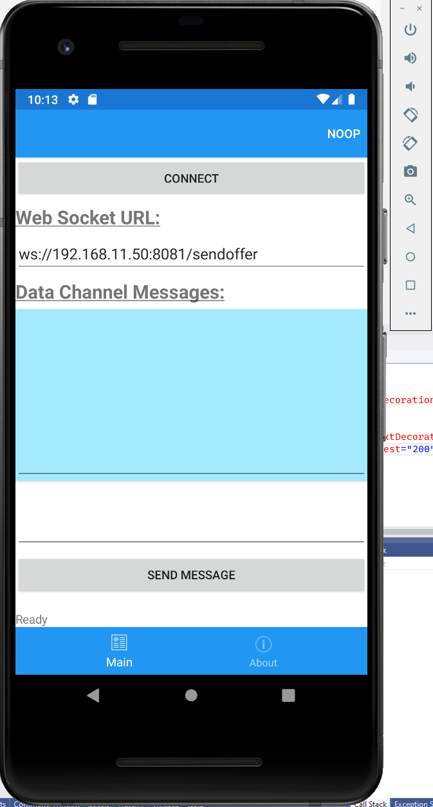
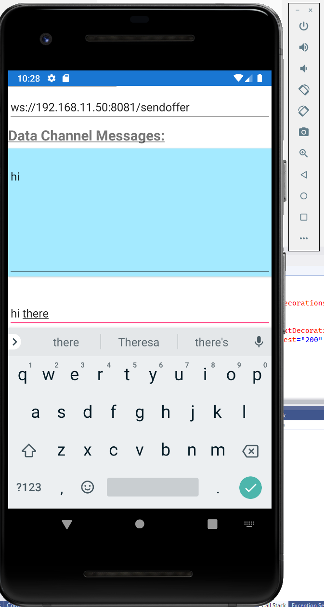
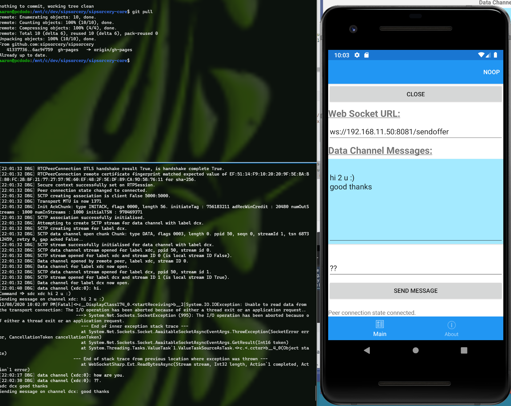

## Usage

The Xamarin test programs (only the Android emulator has been tested) demonstrate how to establish a WebRTC peer connection and exchange data channel messages.

You will need `.Net Core` installed.

The Xamarin test program is designed to work with the [webrtccmdline](https://github.com/sipsorcery/sipsorcery/tree/master/examples/webrtccmdline) console application. In a separate console or terminal start it with:

`dotnet core run --ws`

The `--ws` option indicates that signalling (the exchange of SDP offer/answer and ICE candidates) should be done over a web socket.

````
examples\webrtccmdline>dotnet run --ws
WebRTC Console Test Program
Press ctrl-c to exit.
Starting web socket server...
Waiting for browser web socket connection to 0.0.0.0:8081...
````

 - Start the Xamarin Android application in the emulator:



 - You will need to adjust the `Web Socket URL` to use the IP address of the machine running the `webtcmdline` program. Note the Android emulator runs in a virtual machine and uses a different IP address to the host machine.
 
  - Click the `Connect` button and the `webrtcmdline` application should display log messages indicating the incoming request.

  - Once the peer connection is successfully established the status bar at the bottom of the Xamarin app should display "Peer connection state connected."

  - Data channel messages can now be exchanged:

   - In the Xamarin application enter text in the `Entry Box` above the `Send Message` button and then press the button to send. The message should appear in the `webrtccmdline` console.

   

   - In the `webrtccmdline` console press `Enter` to get a command prompt and then use the `sdc` (send data channel) command below. The message should appear in the Xamarin app.

````
Command => sdc dcx some message
Sending message on channel dcx: some message
````




